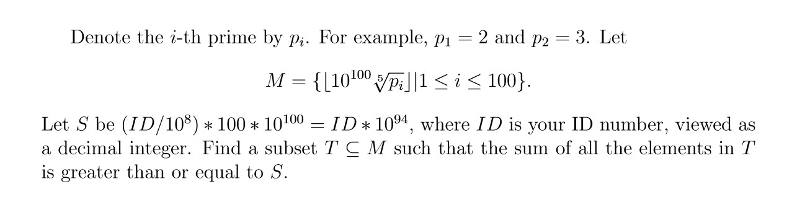

# Subset-Sum/KnapSack Problem

Solve the `Subset-Sum/KnapSack` problem of the following using `LLL/BKZ` algorithms.



## Getting Started

### Prerequisites

- Set id number

    ```python
    1   id = #########
    ```

- Choose the algorithm

    ```python
    44  # Ml = M_temp.LLL() # use LLL algorithm
    45  Ml = M_temp.BKZ()  # use BKZ algorithm
    ```

## Running the tests

Execute **lattice.sagews** on [SageMathCloud](http://www.sagemath.org/)

### Test Cases

ID = 113383597

```text
exp_temp: 0
subset sum: 1133835970574909764137075157805390095711178418581509021723341360376815356433900487050242116227726080091

exp_temp: 1
subset sum: 1133835970020835797465835596483969614816676216575909155382964900743606109161125821898138868027004051132

exp_temp: 2
subset sum: 1133835970009975121508938235167503339853446575182966014543307314299427584526047696339528947641104411889

exp_temp: 3
subset sum: 1133835970000684705584365562218823708278663712538367211369389987450211047543551686579545864776926946404

exp_temp: 4
subset sum: 1133835970000354787690249750379253695590255953169352362745737049267719957140857840871671687073832125747

exp_temp: 5
no result found

exp_temp: 6
subset sum: 1133835970000000077600833904752978572758799083641680371697620185631310614285282052850555308240321085095

exp_temp: 7
no result found

exp_temp: 8
no result found

...
```

## Build With

- [SageMath](http://www.sagemath.org/http://www.sagemath.org/) - A free open-source mathematics software system
